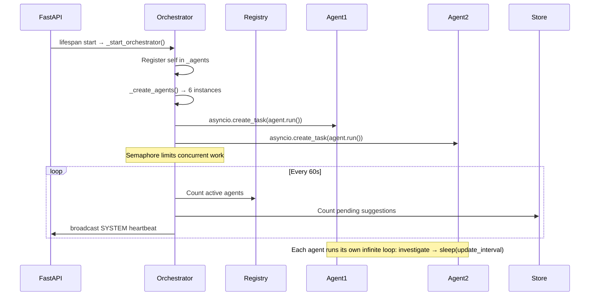
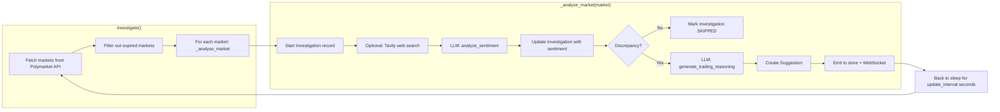
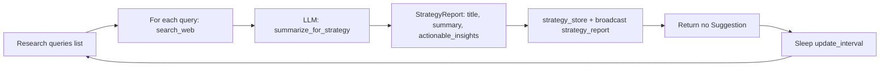
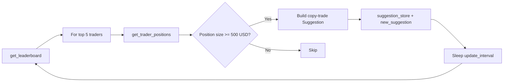
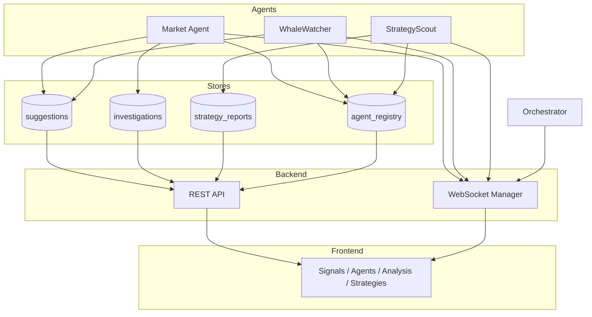

# Polymarket Trader — AI Agent Architecture

This document describes how the **Orchestrator Agent** and all sub-agents work together, the data flow, and where each component lives in the codebase.

---

## 1. High-Level System Flow

```
┌─────────────────────────────────────────────────────────────────────────────────┐
│                              POLYMARKET TRADER                                    │
├─────────────────────────────────────────────────────────────────────────────────┤
│                                                                                   │
│   ┌─────────────┐     lifespan      ┌──────────────────────────────────────┐    │
│   │   run.py    │ ───────────────►  │  FastAPI (main.py)                    │    │
│   │  (launcher) │                   │  • REST API  • WebSocket /ws/updates  │    │
│   └─────────────┘                   └──────────────┬───────────────────────┘    │
│                                                      │                           │
│                                                      │ spawns (async task)      │
│                                                      ▼                           │
│   ┌─────────────────────────────────────────────────────────────────────────┐   │
│   │              ORCHESTRATOR AGENT ("El Joker")                             │   │
│   │  • Registers itself in agent_registry                                    │   │
│   │  • Creates 6 sub-agents (Politics, Crypto, Sports, Science, Scout, Whale) │   │
│   │  • Runs each agent in a separate asyncio Task (semaphore-limited)        │   │
│   │  • Heartbeat every 60s → broadcast SYSTEM event                         │   │
│   └─────────────────────────────────────────────────────────────────────────┘   │
│                                      │                                            │
│                    ┌─────────────────┼─────────────────┐                         │
│                    ▼                 ▼                 ▼                         │
│   ┌────────────────────┐  ┌────────────────────┐  ┌────────────────────┐        │
│   │  MARKET AGENTS     │  │  STRATEGY AGENTS   │  │  SHARED STORES      │        │
│   │  PoliticsAgent     │  │  StrategyScout     │  │  • _suggestions    │        │
│   │  CryptoAgent       │  │  WhaleWatcher     │  │  • _investigations │        │
│   │  SportsAgent       │  │                    │  │  • _strategy_reports│        │
│   │  ScienceAgent      │  │                    │  │  • _agents (registry)│       │
│   └─────────┬──────────┘  └─────────┬──────────┘  └──────────▲─────────┘        │
│             │                       │                         │                   │
│             │    write Suggestions │  write StrategyReports  │                   │
│             │    + Investigations │                         │                   │
│             └──────────────────────┴─────────────────────────┘                   │
│                                                                                   │
│   Frontend (Next.js) ◄──── GET /api/*  +  WebSocket /ws/updates                  │
│   • Dashboard  • Signals  • Agents  • Analysis  • Strategies  • Config           │
└─────────────────────────────────────────────────────────────────────────────────┘
```

---

## 2. Mermaid: Full Architecture Diagram

```mermaid
flowchart TB
    subgraph Entry["🚀 Entry Point"]
        RUN[run.py]
        CONFIG[config.ini]
    end

    subgraph Backend["Backend (FastAPI)"]
        API[main.py - REST + WebSocket]
        WS[/ws/updates]
        API --> WS
    end

    subgraph Orchestrator["♠ Orchestrator Agent (El Joker)"]
        ORCH[OrchestratorAgent.run]
        ORCH --> CREATE[Create 6 sub-agents]
        CREATE --> SPAWN[Spawn asyncio Tasks]
        SPAWN --> SEM[Semaphore: max_parallel_agents]
        SEM --> HEART[Heartbeat every 60s]
        HEART --> ORCH
    end

    subgraph MarketAgents["Market Agents (by category)"]
        POL[PoliticsAgent]
        CRY[CryptoAgent]
        SPO[SportsAgent]
        SCI[ScienceAgent]
    end

    subgraph StrategyAgents["Strategy Agents"]
        SCOUT[StrategyScoutAgent]
        WHALE[WhaleWatcherAgent]
    end

    subgraph External["External Services"]
        PM[Polymarket API]
        LLM[FuelXI / OpenAI]
        TAVILY[Tavily - optional]
    end

    subgraph Stores["In-Memory Stores (main.py)"]
        SUG[_suggestions]
        INV[_investigations]
        STRAT[_strategy_reports]
        REG[_agents registry]
    end

    RUN --> CONFIG
    RUN --> API
    API --> Orchestrator
    ORCH --> MarketAgents
    ORCH --> StrategyAgents
    MarketAgents --> PM
    MarketAgents --> LLM
    MarketAgents --> TAVILY
    StrategyAgents --> PM
    StrategyAgents --> LLM
    MarketAgents --> SUG
    MarketAgents --> INV
    StrategyAgents --> STRAT
    MarketAgents --> REG
    StrategyAgents --> REG
    Orchestrator --> REG
    Stores --> API
    API --> Frontend
    WS --> Frontend

    subgraph Frontend["Frontend (Next.js)"]
        Frontend[Dashboard · Signals · Agents · Analysis · Strategies · Config]
    end
```

---

## 3. Orchestrator Agent Lifecycle



**Orchestrator responsibilities:**

| Responsibility | Implementation |
|----------------|----------------|
| **Spawn sub-agents** | `_create_agents()` returns list of 6 agents (Politics, Crypto, Sports, Science, StrategyScout, WhaleWatcher). |
| **Parallel execution** | Each agent runs in `asyncio.create_task(guarded_run(agent))`. |
| **Concurrency limit** | `asyncio.Semaphore(max_parallel_agents)` so not all 6 run heavy LLM calls at once. |
| **Shared state** | All agents receive the same `agent_registry`, `suggestion_store`, `investigation_store`, `strategy_store`, `ws_manager`, `polymarket_client`. |
| **Heartbeat** | Every 60s logs and broadcasts `SYSTEM` event with `active_agents` and `pending_suggestions`. |

---

## 4. Single Market Agent Flow (e.g. PoliticsAgent)

Every **market agent** (Politics, Crypto, Sports, Science) follows the same pipeline, defined in `MarketBaseAgent`:



**Steps in detail:**

1. **Fetch markets** — `polymarket.get_markets(category=CATEGORY_TAG, active=True, limit=MAX_MARKETS)`.
2. **Filter expired** — Drop any market where `end_date < now` (saves LLM cost).
3. **Per market** — `_analyse_market(market)`:
   - Create an **Investigation** (status `ANALYZING`) and broadcast `investigation_update`.
   - **Web search** (optional) — Tavily query; if no key, LLM uses its own knowledge.
   - **Sentiment** — `llm.analyze_sentiment(news_text, context)` → `{ sentiment, confidence, reasoning, key_factors }`.
   - **Discrepancy** — e.g. bullish + price &lt; 0.60 → BUY; bearish + price &gt; 0.40 → SELL; else skip.
   - **Reasoning** — `llm.generate_trading_reasoning(...)` → `(reasoning_text, confidence_score)`.
   - Build **Suggestion** with `end_date`, `market_url`, and emit to `suggestion_store` + WebSocket `new_suggestion`.
4. **Sleep** — `await asyncio.sleep(update_interval)`, then repeat.

---

## 5. Strategy Agents Flow

### StrategyScoutAgent



- **Role:** Research only. Does **not** create trading Suggestions.
- **Output:** `StrategyReport` → `strategy_store` and WebSocket `strategy_report` for the **Strategies** tab.

### WhaleWatcherAgent



- **Role:** Copy-trading. Creates **Suggestions** like “Copiando a trader #1 (85% win rate)…”
- **Output:** Same `Suggestion` type as market agents → appears in **Signals** queue.

---

## 6. Data Flow: From Agent to UI



| Store | Written by | Consumed by API | WebSocket events |
|-------|------------|-----------------|------------------|
| `_suggestions` | Market agents, WhaleWatcher | `GET /api/suggestions` | `new_suggestion`, `suggestion_update` |
| `_investigations` | Market agents | `GET /api/investigations` | `investigation_update` |
| `_strategy_reports` | StrategyScoutAgent | `GET /api/strategies` | `strategy_report` |
| `_agents` (registry) | All agents + Orchestrator | `GET /api/agents` | `agent_status` |

---

## 7. File Map

| Component | File(s) |
|-----------|--------|
| **Entry** | `run.py`, `config.ini` |
| **API & lifecycle** | `backend/main.py` |
| **Orchestrator** | `backend/agents/orchestrator_agent.py` |
| **Base agent** | `backend/agents/base_agent.py` |
| **Market agents** | `backend/agents/market_agents/_market_base.py`, `politics_agent.py`, `crypto_agent.py`, `sports_agent.py`, `science_agent.py` |
| **Strategy agents** | `backend/agents/strategy_agents/strategy_scout_agent.py`, `whale_watcher_agent.py` |
| **LLM** | `backend/llm_client.py` (FuelXI / OpenAI) |
| **Polymarket** | `backend/polymarket_client.py` |
| **Real-time** | `backend/websocket_manager.py` |
| **Models** | `backend/models.py` |

---

## 8. Summary

- **One Orchestrator** starts with the FastAPI app and creates **6 long-lived agents** in parallel (throttled by a semaphore).
- **Market agents** pull Polymarket markets → filter expired → run LLM sentiment + reasoning → push **Suggestions** and **Investigations**.
- **StrategyScout** only produces **StrategyReports** (no trades).
- **WhaleWatcher** produces **Suggestions** from leaderboard/positions.
- All agents share **registry**, **suggestion_store**, **investigation_store**, **strategy_store**, and **WebSocket**; the frontend reads via REST and listens via `/ws/updates` for live updates.
